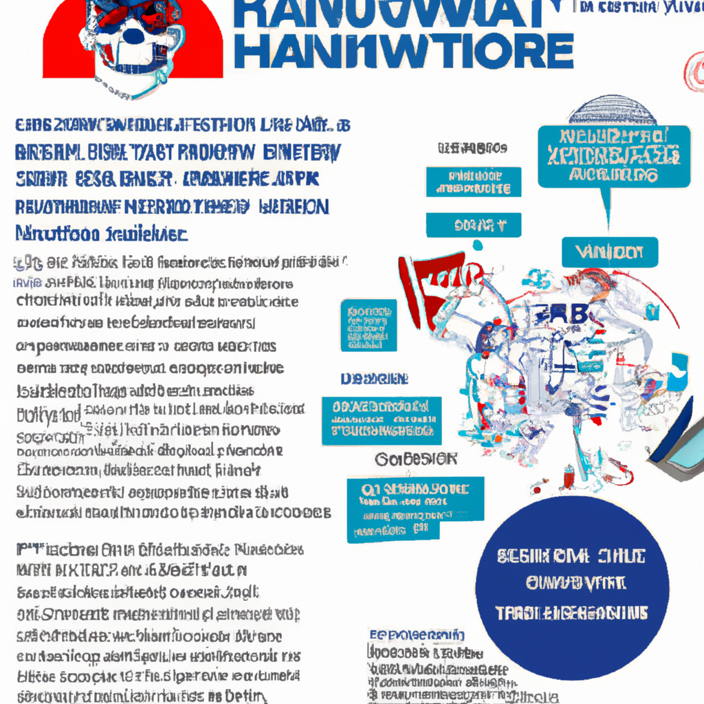

# RansomHub Ransomware Group Targets 210 Victims Across Critical Sectors
**Pubblicato il:** Mon, 02 Sep 2024 19:03:00 +0530

## Traduzione e Argomentazione Tecnica:

Gli attori della minaccia legati al gruppo di ransomware RansomHub hanno criptato ed esfiltrato i dati di almeno 210 vittime dal suo esordio nel febbraio 2024, ha dichiarato il governo degli Stati Uniti. Le vittime provengono da vari settori, tra cui acqua e acque reflue, tecnologia dell'informazione, servizi governativi e strutture, assistenza sanitaria e salute pubblica, servizi di emergenza, cibo e agricoltura, servizi finanziari, strutture commerciali, produzione critica, trasporto e infrastrutture critiche di comunicazione.

"RansomHub è una variante di ransomware-as-a-service, precedentemente nota come Cyclops e Knight, che si è affermata come un modello di servizio efficiente e di successo (attirando recentemente affiliati di alto profilo da altre varianti importanti come LockBit e ALPHV)", hanno dichiarato le agenzie governative. 

Una variante di ransomware-as-a-service (RaaS), discendente di Cyclops e Knight, l'operazione di e-crimine ha attirato affiliati di alto profilo da altre varianti importanti come LockBit e ALPHV (alias BlackCat) a seguito di una recente ondata di azioni delle forze dell'ordine.

ZeroFox, in un'analisi pubblicata alla fine del mese scorso, ha detto che l'attività di RansomHub come proporzione di tutta l'attività di ransomware osservata dal fornitore di cybersecurity è in crescita, rappresentando circa il 2% di tutti gli attacchi nel Q1 2024, il 5,1% nel Q2, e il 14,2% finora nel Q3.

"Circa il 34% degli attacchi di RansomHub ha preso di mira organizzazioni in Europa, rispetto al 25% in tutto il panorama delle minacce", ha notato l'azienda.

Il gruppo è noto per utilizzare il modello di doppia estorsione per esfiltrare i dati e criptare i sistemi al fine di estorcere le vittime, che sono invitate a contattare gli operatori tramite un unico URL .onion. Le aziende bersaglio che rifiutano di acconsentire alla richiesta di riscatto vedono le loro informazioni pubblicate sul sito di fuga dei dati per un periodo compreso tra tre e 90 giorni. L'accesso iniziale agli ambienti delle vittime è facilitato sfruttando vulnerabilità di sicurezza note in dispositivi come Apache ActiveMQ (CVE-2023-46604), Atlassian Confluence Data Center e Server (CVE-2023-22515), Citrix ADC (CVE-2023-3519), F5 BIG-IP (CVE-2023-46747), Fortinet FortiOS (CVE-2023-27997), e Fortinet FortiClientEMS (CVE-2023-48788), tra gli altri.

Questo passaggio è seguito da affiliati che conducono attività di ricognizione e scanning della rete utilizzando programmi come AngryIPScanner, Nmap, e altri metodi di tipo living-off-the-land (LotL). Gli attacchi di RansomHub prevedono inoltre la disattivazione del software antivirus utilizzando strumenti personalizzati per passare inosservati.

"Dopo l'accesso iniziale, gli affiliati di RansomHub hanno creato account utente per la persistenza, riabilitato account disabilitati, e utilizzato Mimikatz sui sistemi Windows per raccogliere credenziali [T1003] ed elevare i privilegi a SYSTEM", si legge nell'avviso del governo degli Stati Uniti.

"Gli affiliati si sono poi mossi lateralmente all'interno della rete attraverso metodi che includono il Protocollo Desktop Remoto (RDP), PsExec, AnyDesk, Connectwise, N-Able, Cobalt Strike, Metasploit, o altri metodi di comando e controllo (C2) comunemente utilizzati". Un altro aspetto notevole degli attacchi di RansomHub è l'uso della crittografia intermittente per accelerare il processo, con esfiltrazione di dati osservata attraverso strumenti come PuTTY, bucket Amazon AWS S3, richieste HTTP POST, WinSCP, Rclone, Cobalt Strike, Metasploit, e altri metodi.

Lo sviluppo arriva mentre Palo Alto Networks Unit 42 ha analizzato le tattiche associate al ransomware ShinyHunters, che traccia come Bling Libra, evidenziando il suo passaggio all'estorsione delle vittime rispetto alla sua tattica tradizionale di vendere o pubblicare dati rubati. L'attore della minaccia è emerso per la prima volta nel 2020.

"Il gruppo acquisisce credenziali legittime, provenienti da repository pubblici, per ottenere l'accesso iniziale all'ambiente Amazon Web Services (AWS) di un'organizzazione", hanno detto i ricercatori di sicurezza Margaret Zimmermann e Chandni Vaya.

"Sebbene i permessi associati alle credenziali compromesse abbiano limitato l'impatto della violazione, Bling Libra ha infiltrato l'ambiente AWS dell'organizzazione e ha condotto operazioni di ricognizione. Il gruppo di attori della minaccia ha utilizzato strumenti come il browser del servizio di archiviazione semplice Amazon (S3) e WinSCP per raccogliere informazioni sulle configurazioni dei bucket S3, accedere agli oggetti S3 e cancellare i dati."

Seguono anche una significativa evoluzione negli attacchi di ransomware, che sono andati oltre la crittografia dei file per impiegare strategie di estorsione complesse e multifaccettate, persino utilizzando schemi di estorsione tripla e quadrupla, secondo SOCRadar.

"L'estorsione tripla alza la posta in gioco, minacciando ulteriori mezzi di interruzione oltre alla crittografia e all'esfiltrazione", ha detto l'azienda.

"Ciò potrebbe comportare la conduzione di un attacco DDoS contro i sistemi della vittima o l'estensione di minacce dirette ai clienti, fornitori o altri associati della vittima per provocare ulteriori danni operativi e di reputazione a coloro che sono in definitiva presi di mira nel piano di estorsione."

L'estorsione quadrupla alza la posta in gioco contattando terze parti che hanno relazioni commerciali con le vittime e estorcendole, o minacciando le vittime di esporre i dati di terze parti per aumentare ulteriormente la pressione su una vittima per farla pagare.

La natura lucrativa dei modelli RaaS ha alimentato un aumento delle nuove varianti di ransomware come Allarich, Cronus, CyberVolk, Datablack, DeathGrip, Hawk Eye, e Insom. Ha anche portato gli attori dello stato-nazione iraniano a collaborare con gruppi noti come NoEscape, RansomHouse, e BlackCat in cambio di una parte dei proventi illeciti.

Hai trovato interessante questo articolo? Seguici su Twitter e LinkedIn per leggere altro contenuto esclusivo che pubblichiamo.

